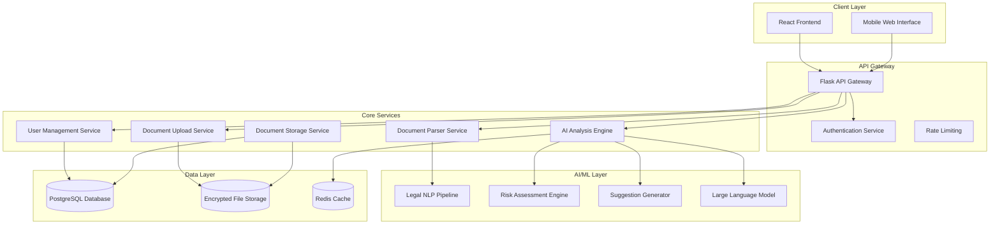

# Design Document: Legalize - AI-Powered Legal Contract Analyzer

## Overview

Legalize is a web-based platform that democratizes legal contract understanding for the Indian market. The system employs advanced Natural Language Processing (NLP) and machine learning techniques to analyze legal documents, providing plain-language summaries, risk assessments, and improvement suggestions tailored to Indian legal contexts.

The platform follows a microservices architecture with a React frontend and Python Flask backend, designed to handle sensitive legal documents with enterprise-grade security and privacy controls. The AI analysis engine leverages specialized legal language models and Indian jurisdiction-specific knowledge to provide accurate, contextually relevant insights.

## Architecture

### High-Level Architecture



### Technology Stack

**Frontend:**
- React 18+ with TypeScript for type safety
- Material-UI or Chakra UI for consistent design system
- React Query for state management and API caching
- React Router for navigation
- Axios for HTTP client with interceptors

**Backend:**
- Python 3.11+ with Flask framework
- SQLAlchemy ORM for database operations
- Celery for asynchronous task processing
- Redis for caching and session storage
- JWT for stateless authentication

**AI/ML Stack:**
- Transformers library for legal language models
- spaCy for text preprocessing and entity recognition
- Legal-BERT or specialized legal language models
- Large Language Models (LLMs) for advanced legal reasoning and clause analysis
- scikit-learn for risk classification models

**Infrastructure:**
- PostgreSQL for structured data storage
- AWS S3 or similar for encrypted document storage
- Docker containers for deployment
- Nginx for reverse proxy and load balancing

## Components and Interfaces

### Document Upload Service

**Responsibilities:**
- Handle multi-format file uploads (PDF, DOC, DOCX)
- Validate file types, sizes, and content
- Perform virus scanning and security checks
- Store encrypted documents in secure storage
- Generate unique document identifiers

**Key Interfaces:**
```python
class DocumentUploadService:
    def upload_document(self, file: FileUpload, user_id: str) -> DocumentMetadata
    def validate_file(self, file: FileUpload) -> ValidationResult
    def extract_text(self, document_id: str) -> ExtractedText
    def get_document_metadata(self, document_id: str) -> DocumentMetadata
```

### Document Parser Service

**Responsibilities:**
- Extract text from various document formats
- Handle OCR for scanned documents
- Preserve document structure and formatting
- Identify document sections and clauses
- Clean and normalize extracted text

**Key Interfaces:**
```python
class DocumentParserService:
    def parse_document(self, document_id: str) -> ParsedDocument
    def extract_clauses(self, parsed_doc: ParsedDocument) -> List[Clause]
    def identify_parties(self, parsed_doc: ParsedDocument) -> List[Party]
    def classify_contract_type(self, parsed_doc: ParsedDocument) -> ContractType
```

### AI Analysis Engine

**Responsibilities:**
- Coordinate all AI-powered analysis tasks
- Generate plain-language summaries
- Perform risk assessment from party perspective
- Generate clause improvement suggestions
- Maintain analysis context and state

**Key Interfaces:**
```python
class AIAnalysisEngine:
    def analyze_contract(self, document_id: str, party_perspective: str) -> AnalysisResult
    def generate_summary(self, parsed_doc: ParsedDocument) -> Summary
    def assess_risks(self, clauses: List[Clause], perspective: str) -> RiskAssessment
    def suggest_improvements(self, risky_clauses: List[Clause]) -> List[Suggestion]
```

### Legal NLP Pipeline

**Responsibilities:**
- Preprocess legal text for analysis
- Extract legal entities and concepts
- Identify clause types and relationships
- Handle Indian legal terminology and context
- Support multi-language processing

**Key Interfaces:**
```python
class LegalNLPPipeline:
    def preprocess_text(self, text: str) -> ProcessedText
    def extract_entities(self, text: str) -> List[LegalEntity]
    def classify_clauses(self, clauses: List[str]) -> List[ClauseType]
    def detect_language(self, text: str) -> Language
```

### Risk Assessment Engine

**Responsibilities:**
- Evaluate clause fairness and balance
- Assign risk levels (Low, Medium, High, Critical)
- Consider Indian legal standards and practices
- Account for party-specific perspectives
- Generate risk explanations and rationales

**Key Interfaces:**
```python
class RiskAssessmentEngine:
    def assess_clause_risk(self, clause: Clause, perspective: str) -> RiskScore
    def evaluate_contract_balance(self, clauses: List[Clause]) -> BalanceScore
    def identify_unfair_terms(self, clauses: List[Clause]) -> List[UnfairTerm]
    def generate_risk_explanation(self, risk: RiskScore) -> str
```

### User Management Service

**Responsibilities:**
- Handle user registration and authentication
- Manage user sessions and permissions
- Store user preferences and settings
- Maintain document access controls
- Handle password reset and account recovery

**Key Interfaces:**
```python
class UserManagementService:
    def register_user(self, user_data: UserRegistration) -> User
    def authenticate_user(self, credentials: LoginCredentials) -> AuthToken
    def get_user_documents(self, user_id: str) -> List[DocumentMetadata]
    def update_user_preferences(self, user_id: str, prefs: UserPreferences) -> bool
```

## Data Models

### Core Entities

```python
@dataclass
class User:
    id: str
    email: str
    password_hash: str
    preferred_language: str
    created_at: datetime
    last_login: datetime
    is_active: bool

@dataclass
class Document:
    id: str
    user_id: str
    filename: str
    file_type: str
    file_size: int
    upload_timestamp: datetime
    storage_path: str
    encryption_key: str
    is_processed: bool

@dataclass
class ParsedDocument:
    document_id: str
    extracted_text: str
    contract_type: ContractType
    identified_parties: List[Party]
    clauses: List[Clause]
    metadata: Dict[str, Any]

@dataclass
class Clause:
    id: str
    document_id: str
    text: str
    clause_type: ClauseType
    section: str
    position: int
    risk_level: RiskLevel
    is_modified: bool

@dataclass
class AnalysisResult:
    document_id: str
    user_id: str
    selected_party: str
    summary: Summary
    risk_assessment: RiskAssessment
    suggestions: List[Suggestion]
    created_at: datetime

@dataclass
class RiskAssessment:
    overall_risk: RiskLevel
    risky_clauses: List[RiskyClause]
    risk_explanation: str
    party_perspective: str

@dataclass
class Suggestion:
    clause_id: str
    original_text: str
    suggested_text: str
    improvement_rationale: str
    risk_reduction: str
    priority: Priority
```

### Enumerations

```python
class ContractType(Enum):
    RENTAL_AGREEMENT = "rental_agreement"
    EMPLOYMENT_CONTRACT = "employment_contract"
    NDA = "nda"
    VENDOR_AGREEMENT = "vendor_agreement"
    SERVICE_AGREEMENT = "service_agreement"
    PARTNERSHIP_AGREEMENT = "partnership_agreement"
    UNKNOWN = "unknown"

class RiskLevel(Enum):
    LOW = "low"
    MEDIUM = "medium"
    HIGH = "high"
    CRITICAL = "critical"

class ClauseType(Enum):
    TERMINATION = "termination"
    PAYMENT = "payment"
    LIABILITY = "liability"
    CONFIDENTIALITY = "confidentiality"
    INTELLECTUAL_PROPERTY = "intellectual_property"
    DISPUTE_RESOLUTION = "dispute_resolution"
    FORCE_MAJEURE = "force_majeure"
    GOVERNING_LAW = "governing_law"

class Language(Enum):
    ENGLISH = "en"
    HINDI = "hi"
    BENGALI = "bn"
    TAMIL = "ta"
    TELUGU = "te"
    MARATHI = "mr"
    GUJARATI = "gu"
```

## Error Handling

### Error Classification

**Input Validation Errors:**
- Invalid file formats or corrupted files
- Oversized documents exceeding limits
- Malformed or empty document content
- Unsupported languages or character encodings

**Processing Errors:**
- OCR failures on scanned documents
- AI model timeouts or service unavailability
- Text extraction failures from complex layouts
- Language detection or translation errors

**Business Logic Errors:**
- Insufficient document content for analysis
- Unrecognizable contract types or structures
- Missing critical clauses for risk assessment
- Party identification failures

**System Errors:**
- Database connection failures
- File storage service unavailability
- Authentication service timeouts
- Rate limiting violations

### Error Handling Strategy

**Graceful Degradation:**
- Provide partial analysis when full processing fails
- Offer manual party selection when auto-detection fails
- Fall back to basic text extraction when advanced parsing fails
- Display cached results when real-time analysis is unavailable

**User-Friendly Error Messages:**
- Convert technical errors to plain language explanations
- Provide actionable steps for error resolution
- Suggest alternative approaches when primary methods fail
- Include contact information for complex issues

**Retry and Recovery:**
- Implement exponential backoff for transient failures
- Queue failed analyses for retry during off-peak hours
- Maintain processing state for resumable operations
- Provide manual retry options for user-initiated actions

## Testing Strategy

### Dual Testing Approach

The testing strategy employs both unit testing and property-based testing to ensure comprehensive coverage and correctness validation.

**Unit Testing Focus:**
- Specific examples demonstrating correct behavior
- Edge cases and error conditions
- Integration points between components
- API endpoint validation with known inputs
- Database operations with sample data

**Property-Based Testing Focus:**
- Universal properties that hold across all valid inputs
- Comprehensive input coverage through randomization
- Invariant preservation during document processing
- Round-trip properties for serialization/deserialization
- Risk assessment consistency across similar clauses

### Property-Based Testing Configuration

**Testing Library:** Hypothesis (Python) for backend property tests
**Test Configuration:** Minimum 100 iterations per property test
**Tagging Format:** Each test tagged with **Feature: legalize, Property {number}: {property_text}**

**Key Testing Areas:**
- Document parsing preserves content integrity
- Risk assessment produces consistent results for equivalent clauses
- User data isolation and access control enforcement
- API response format consistency across all endpoints
- Encryption/decryption round-trip properties for document storage

## Correctness Properties

*A property is a characteristic or behavior that should hold true across all valid executions of a system—essentially, a formal statement about what the system should do. Properties serve as the bridge between human-readable specifications and machine-verifiable correctness guarantees.*

### Property 1: File Upload Validation
*For any* uploaded file, the system should accept it if and only if it is in a supported format (PDF, DOC, DOCX), within size limits, and contains valid content
**Validates: Requirements 1.1, 1.2, 1.4, 1.5**

### Property 2: Text Extraction Completeness  
*For any* successfully uploaded contract document, text extraction should produce non-empty content that preserves the original document's textual information
**Validates: Requirements 1.3**

### Property 3: Party Identification Consistency
*For any* contract containing party references, the system should identify all mentioned parties and present them as selectable options, with manual input available as fallback
**Validates: Requirements 2.1, 2.2, 2.4**

### Property 4: Analysis Perspective Maintenance
*For any* selected party perspective, all risk analysis and suggestions should consistently reflect that party's interests throughout the session
**Validates: Requirements 2.3, 2.5, 4.1**

### Property 5: Summary Generation Completeness
*For any* processed contract, the generated summary should be non-empty, structured into logical sections, cover all major provisions, and use accessible language with explanations for unavoidable legal terms
**Validates: Requirements 3.1, 3.2, 3.3, 3.4, 3.5**

### Property 6: Risk Assessment Consistency
*For any* contract clause, risk assessment should assign appropriate risk levels (Low, Medium, High, Critical), provide explanations, and present findings ordered by severity
**Validates: Requirements 4.2, 4.3, 4.4, 4.5**

### Property 7: Suggestion Generation Completeness
*For any* risky clause, the system should generate at least one alternative suggestion with clear explanations of benefits and specific risks addressed
**Validates: Requirements 5.1, 5.2, 5.5**

### Property 8: Document Editing Integrity
*For any* clause modification, the system should preserve original text, clearly mark changes, allow reversion, and maintain document formatting
**Validates: Requirements 6.1, 6.2, 6.3, 6.4, 6.5**

### Property 9: Data Persistence Completeness
*For any* completed analysis, saving should store both original and revised document versions along with all analysis metadata, and make them retrievable in subsequent sessions
**Validates: Requirements 7.1, 7.2, 7.3, 7.4**

### Property 10: Export Functionality
*For any* saved contract, the system should allow download in standard formats while preserving content and formatting
**Validates: Requirements 7.5**

### Property 11: Authentication Security
*For any* user registration or login attempt, the system should properly hash credentials, establish secure sessions, and enforce session expiration with re-authentication requirements
**Validates: Requirements 8.1, 8.2, 8.4, 8.5**

### Property 12: Access Control Enforcement
*For any* user session, the system should ensure users can only access their own documents and analysis results, preventing unauthorized access to other users' data
**Validates: Requirements 8.3, 9.2**

### Property 13: Data Encryption Round-trip
*For any* document uploaded to the system, encryption and decryption should preserve the original content exactly while protecting data in transit and at rest
**Validates: Requirements 9.1**

### Property 14: Data Deletion Completeness
*For any* user-initiated document deletion, all associated data including metadata should be permanently removed and no longer retrievable
**Validates: Requirements 9.5**

### Property 15: Multilingual Processing Support
*For any* document in supported languages (English and major Indian languages), the system should process content appropriately and provide analysis in the user's preferred language
**Validates: Requirements 10.1, 10.2, 10.3, 10.5**

### Property 16: Contract Type-Aware Analysis
*For any* uploaded contract, the system should identify the contract type and apply specialized analysis rules, highlighting type-specific risks and providing relevant guidance
**Validates: Requirements 11.1, 11.2, 11.3, 11.5**